<h1 align="center">Optimal Racing Strategy for Maximising Exit Speed Out of a Chicane — A Telemetry-Based Analysis of the Melbourne Albert Park Circuit </h1>

## Project Description

This project explores how Formula 1 drivers can optimise their driving through the first two corners of the Albert Park Grand Prix Circuit in Melbourne. The study focuses on understanding how braking, throttle application, and steering control interact to generate the most expeditious racing line. The main research question we want to answer: 

*What is the optimal combination of driving inputs and racing path to take through Turns 1 and 2 at Melbourne Albert Park Circuit?*

A successful start is a critical determinant of the final race results in Formula 1 racing, as the positions gained or lost on this first lap have a strong correlation with overall performance. To navigate through Turns 1 and 2 optimally, a fast exit from Turn 2 is desired, allowing the driver to successfully build a gap ahead of pursuing vehicles. This advantage creates an environment that is significantly more difficult for opponents to overtake, as it breaks the Drag Reduction System’s (DRS) effect. Hence, an in-depth understanding of the optimal combination of braking, throttle, and steering input required to generate this upper hand is significant.

Our study has selected exit speed from Turn 2 as our critical response variable instead of other variables, such as lap times or sector times. The motivation behind this decision is due to the unique dynamics of the Turn 1 and Turn 2 chicane, which is supported by vehicle dynamics literature. According to research (Velenis and Tsiotras, 2005), the minimum-time and maximum exit-velocity are two distinct optimisation goals, with both leading to different trajectories and control inputs. In their prioritising exit-speed strategy, it was shown that this resulted in a higher terminal velocity that can be transmitted down the subsequent straight path; however, this occurs at the cost of a slightly slower cornering time. In relation to the named Albert Park Circuit, a fast exit speed is ideal for building a gap that disrupts the DRS activation for subsequent vehicles. Thus, optimising for exit speed ultimately provides a more targeted and insightful measure of performance.

This report builds upon previous research on motorsport analysis and vehicle dynamic models. However, we focus specifically on the telemetry collected from the Melbourne Albert Park Grand Prix Circuit. The aim is to produce an optimal combination of braking, throttle, and steering inputs that the driver should utilise to navigate through turns 1 and 2 - which as a result would maximise their exit speed.

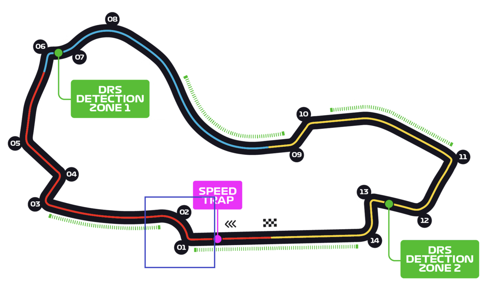

## Sources
Our raw data uses telemetry data obtained by Oracle through F1 video game simulations in 2024.

The source data can be found in [Data/Source_Data](Data/Source_Data) folder of our repository which includes the following raw data files:

- [UNSW F12024](Data/Source_Data/UNSW_F12024.csv) Data: Telemetry data for the race, includes driver input control, and positional data.
- [f1sim-ref-left](Data/Source_Data/f1sim-ref-right.csv): Data coordinates for the left boundary of the track.
- [f1sim-ref-right](Data/Source_Data/f1sim-ref-right.csv): Data coordinates for the right boundary of the track.
- [f1sim-ref-line](Data/Source_Data/f1sim-ref-line.csv): Data coordinates of the centre racing line of the track.
- [f1sim-ref-turns](Data/Source_Data/f1sim-ref-turns.csv): Data coordinates for the apex of each turn of the track.

## Data Workflow
### Basic Filtering
*Track Filtering*

The raw dataset contains telemetry from four different tracks. Since our analysis focuses on the Albert Park Circuit (Track 0), we first filter the data to remove the other tracks.

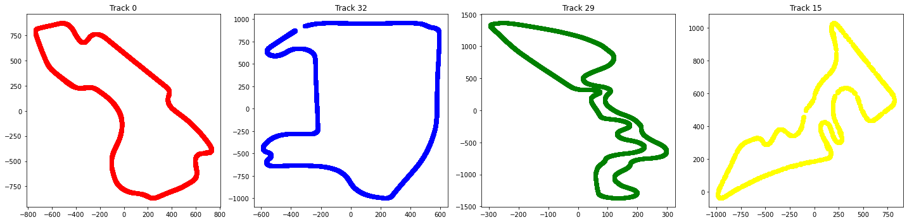

Next, as our research goal is to study how to maximise exit speed at Turn 2, we narrow down the dataset to only include data points within a specific region of the circuit that captures turns 1 and 2 and the straights before and after. This region is defined by the following coordinate bounds:

- **X range:** 200 ≤ x ≤ 600  
- **Y range:** -180 ≤ y ≤ 400

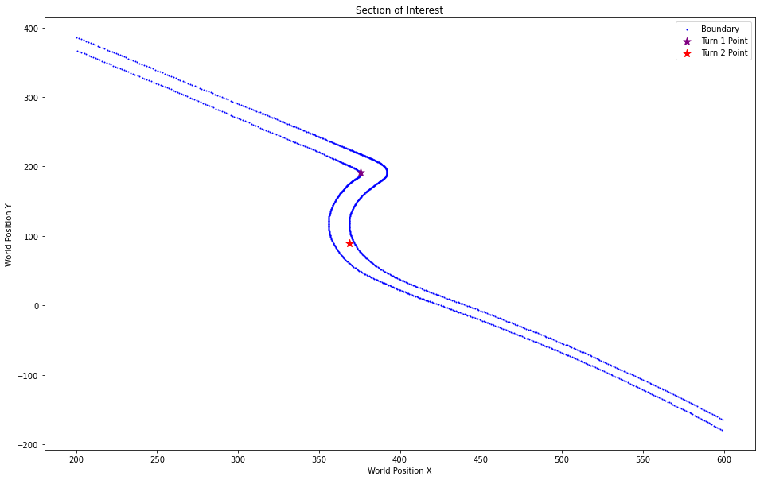

This filtering ensures that our analysis focuses exclusively on the portion of the circuit relevant to our research, reducing noise from irrelevant parts of the track and making the results more interpretable.

---

*Irrelevant Features and Empty Values*

From the original raw dataset, we performed a systematic feature selection process to retain only the variables that were directly relevant to our research objective — analysing driver performance and speed optimisation through Turn 2.

A large number of telemetry variables were excluded because they:

- Contained **no meaningful variation** across sessions (e.g., constants or near-constant readings).  
- Were **entirely empty**.
- Captured **details unrelated** to our research question or features beyond the driver's control.  
- Represented **redundant information** already expressed by other features.

The variables retained were those that encapsulate **driver controls and decisions** that would impact their turn 2 performance, including:

- **`M_SPEED_1`** — the primary response variable which we engineer later as a metric for the driver's performance.
- **Driver control inputs** — `M_THROTTLE_1`, `M_BRAKE_1`, and `M_GEAR_1`, which together characterise the driver’s control decisions.  
- **Positional data** — `M_WORLDPOSITIONX_1`, `M_WORLDPOSITIONY_1`, `M_WORLDPOSITIONZ_1`, which describe the path the driver takes.

In addition, all retained features were checked for and cleansed of missing (NaN) values to ensure data consistency and prevent interpolation or modelling errors during subsequent analysis.

By eliminating irrelevant features, we reduced noise in the dataset and improved interpretability. This streamlined structure ensures that all subsequent analyses and modelling efforts are focused on the variables most influential to **driver control strategy and their Turn 2 exit performance**.

---

### Advanced Filtering

*Nonracing Behaviour*

The first stage of advanced filtering focused on removing **non-racing behaviour** to ensure that only valid on-track performance data was retained for analysis.  
Non-racing behaviour was identified through three key indicators:

- **Reversing:** Instances where the car entered reverse gear (`M_GEAR_1 == -1`).  
- **Neutral gear:** Periods where the gearbox was disengaged (`M_GEAR_1 == 0`).  
- **Slow speeds:** Samples where the vehicle’s speed dropped below **30 km/h**, a threshold chosen to exclude idle movement or potential post-spin recovery.

By analysing these conditions, we were able to flag and remove entire laps or sessions that contained any of these behaviours within the defined section of the track.  
This step was critical for ensuring that subsequent modelling reflected true racing conditions rather than anomalies or outliers caused by non-competitive driving states.

The figures below illustrate several examples of such anomalies detected during this filtering process. Click to expand!

<p align="center">
  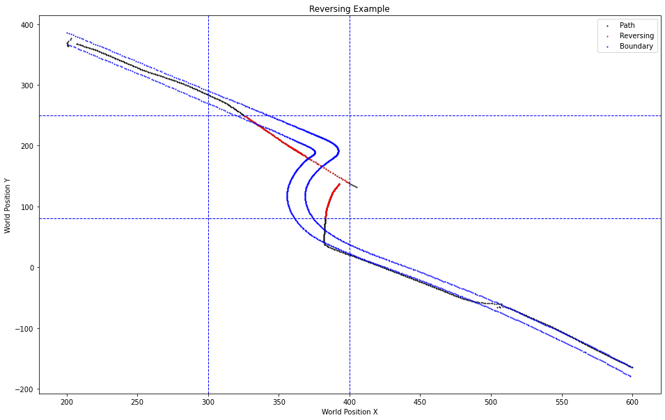
  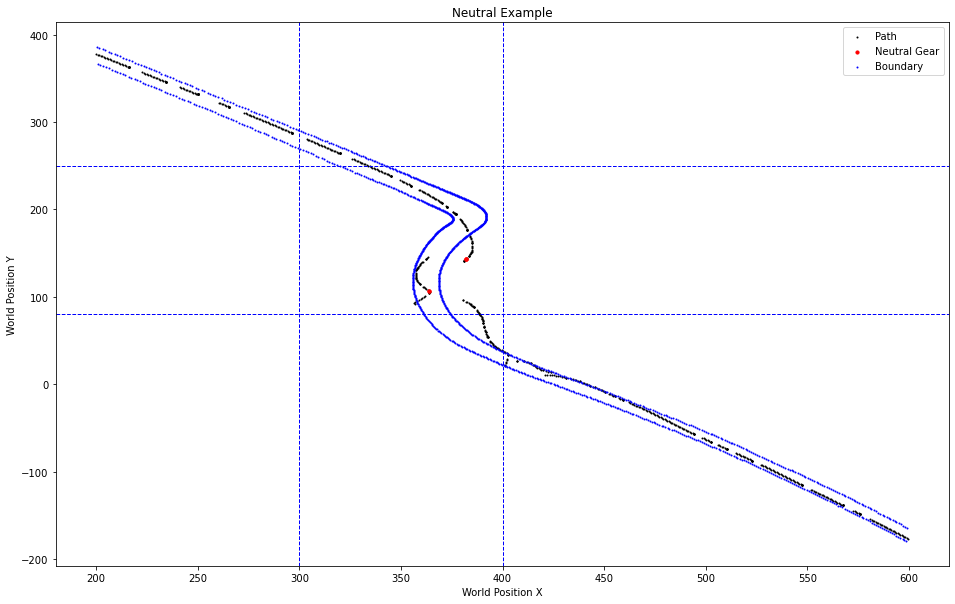
  
</p>

---

*Faulty Trajectories*

To ensure that our analyses reflect genuine on-track behaviour, we applied additional filters to remove **faulty trajectories**. This includes:

- **Stagnant positions (duplicate XYZ)**  
  Consecutive or repeated `(X, Y, Z)` coordinates indicate the car was stationary or the telemetry was frozen. We identify duplicate position triples within each `(SESSION_GUID, M_CURRENTLAPNUM)` and drop duplicates (keeping one).

- **Abnormally high sample counts per lap**  
  Laps with far more than the modal 192 samples typically arise from game system error, most likely due to something occuring during the race.

- **Abnormally low sample counts per lap**  
  Laps with substantially fewer than 192 samples are generally **incomplete** with parts of their trajectory missing.

Below are example plots of each faulty example. Click to expand!

<p align="center">
  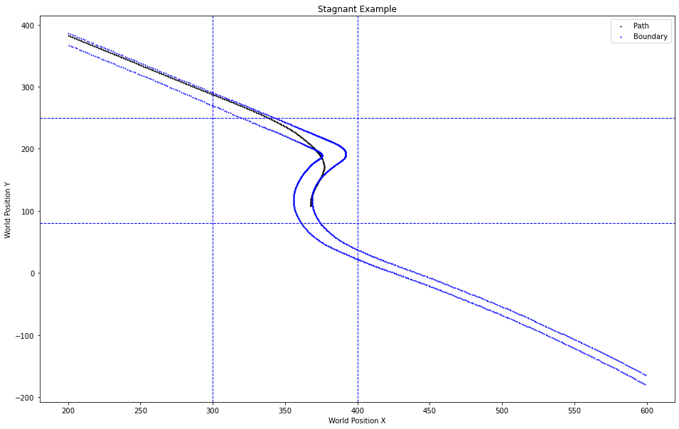
  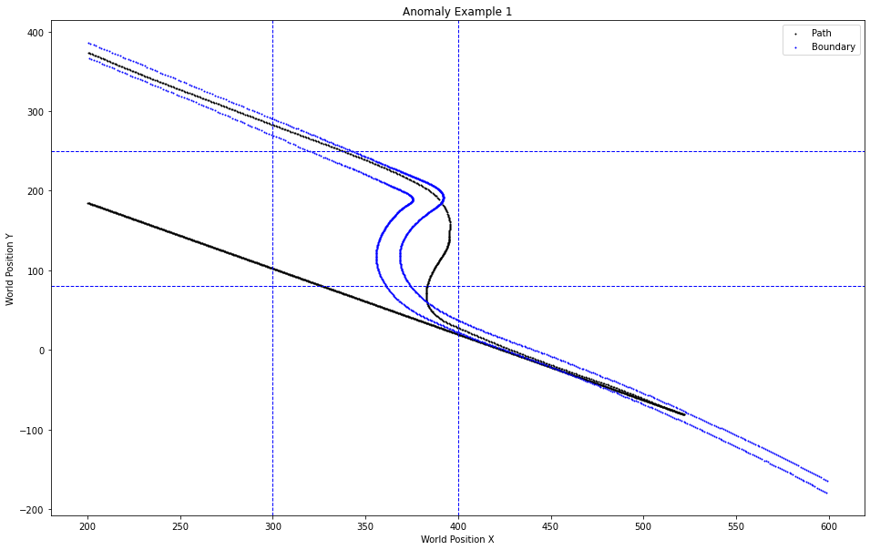
</p>
<p align="center">
  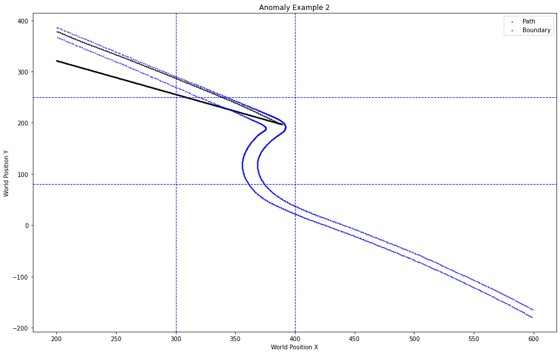
  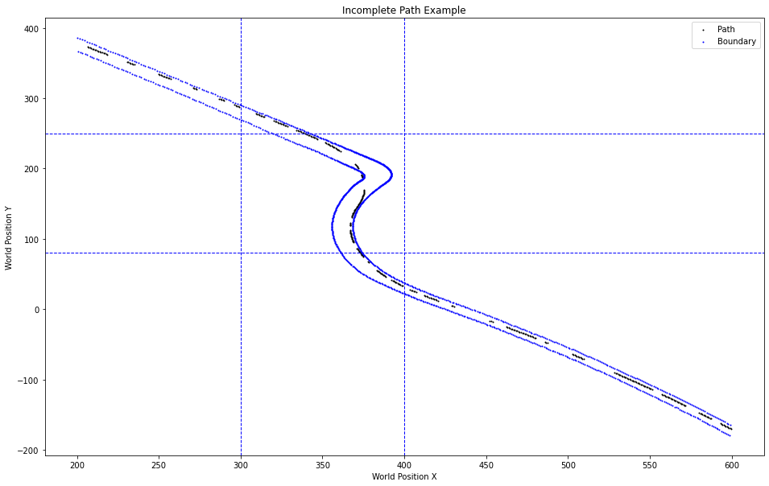
</p>

Removing stagnant points and outlier laps with high/low sample counts improves the reliability of interpolated metrics when engineering data for our reseach later on. Hence we kept laps that have data samples ranging from 180 to 220 counts for reliability.

---
  
### Engineered Data

The engineering process focused on transforming the cleaned telemetry data into a structured and analysis-ready format suitable for performance comparison across key locations on the circuit. This section outlines how we defined the **critical points**, **critical lines**, and **extracted performance statistics** for each unique lap.

---

*Critical Points*

The first step was identifying critical spatial references on the track that represent significant driver actions or trajectory transitions.  
- **Turn 1 and Turn 2** were defined directly from the original dataset’s reference data.  
- An **additional midpoint** was defined between Turns 1 and 2 to capture driver behaviour in the short acceleration zone that connects the two corners.  
- To capture braking dynamics, we also determined the **average braking point** — defined as the location where drivers first applied full braking input (`M_BRAKE_1 == 1`) before Turn 1.

These points collectively provide a spatial framework for analysing how drivers approach, navigate, and exit the chicane turn sequence. A visual of the critical points and how the braking point was found is given below.

<p align="center">
  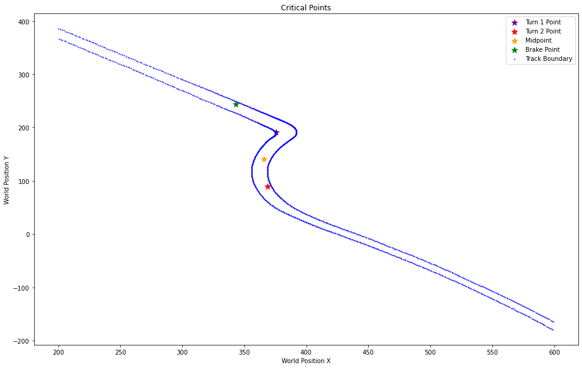
  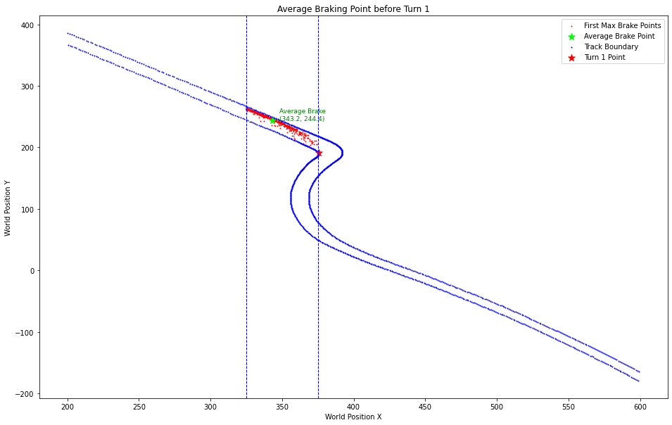
</p>

---

*Critical Lines*

For each critical point, we determined the **closest left and right boundary points** from the track geometry data. Connecting these two points defined a **critical line**, which represents a consistent cross-section of the track at that location.

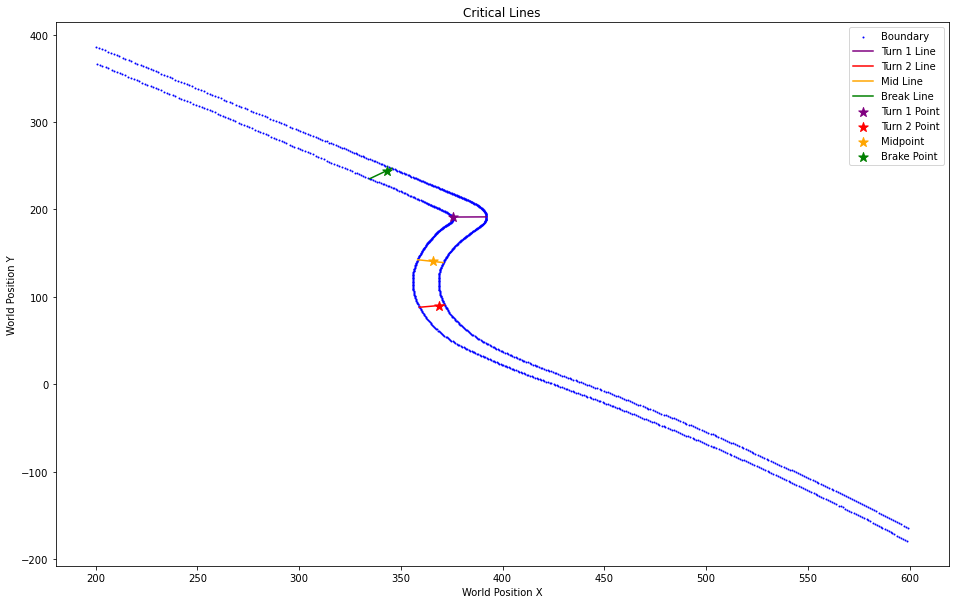

Each critical line acts as a measurement reference, enabling consistent comparison of driver inputs and vehicle states across laps. This provides a clear basis for analysing how driver behaviour evolves through key phases of this chicane turn.

---

*Extracting Statistics*

To quantify performance, we extracted relevant telemetry metrics at each critical line for every unique `(SESSION_GUID, M_CURRENTLAPNUM)` pair.  

- We used the **closest telemetry point before crossing** each line to ensure the sample reflects the most immediate data prior to line intersection.  
- There was also an **attempt to interpolate** between points to pinpoint the *exact* crossing on the line. While theoretically more precise, this approach occasionally failed for trajectories that did not actually intersect the line, introducing errors in the results. If interpolation were applied successfully, it would enable finer comparison of driver behaviour across different laps, particularly when evaluating micro-differences in line choice and input timing.   

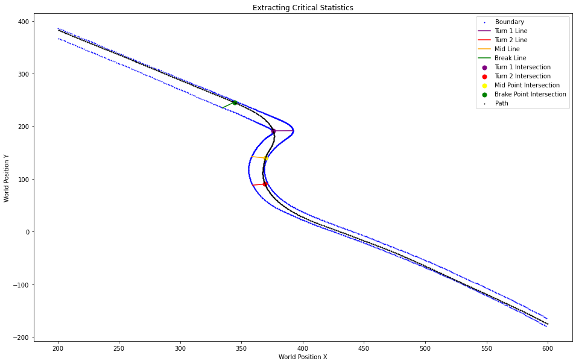

---

*On Track Variable*

For each critical line, we also generated an **on-track variable**, indicating whether a driver remained within the circuit boundaries at that section. This variable provides an additional layer of interpretability — distinguishing between valid and invalid lap segments and supporting subsequent performance modelling.

---
## Data Description

Our final processed dataset contains 12 features, each representing telemetry data from a driver at a specific point of a lap. The dataset comprises approximately 5 driver/session identifiers, 5 performance metrics (such as speed and lap times), and 3 positional variables (including world coordinates and track boundaries). This structure supports focused analysis of speed, track position, and overtaking opportunities.

*Final Data Dictionary*
| Column              | Type     | Range/Values | Description                                                                 |
|---------------------|----------|--------------|-----------------------------------------------------------------------------|
| SESSION_GUID        | object   | NaN          | unique session id (global unique id)                                        |
...

A subset of the data columns is shown above for illustration. For complete field descriptions, data types, and value ranges, please refer to [Full Final Data Dictionary](Data/Cleaned_Data/Final_Data_Dictionary.csv).

*Engineered Data Dictionary* 

The engineered dataset turn_2_exit_stats (located in the Engineered_Data folder) contains the interpolated metrics such as speed, throttle and brake for all unique sessions's individual laps, as well as map positioning features x_coord, y_coord, and alpha

| Column             | Type      | Range/Values   | Description                                                                 |
|--------------------|-----------|----------------|-----------------------------------------------------------------------------|
| Gear               | boolean   | [True, False]  | current gear selection of the vehicle: gear 1-8 = forward gear              |
...

A subset of the data columns is shown above for illustration. For complete field descriptions, data types, and value ranges, please refer to [Full Engineered Data Dictionary](Data/Engineered_Data/Engineered_Data_Dictionary.csv).

## Literature Research

Optimal lap performance in motorsport depends on a fine balance between the **racing trajectory** and the **driver’s control inputs**, constrained by the limits of the tyres’ friction circle ([Xiong, 2010](http://hdl.handle.net/1721.1/64669)). The optimal racing line typically minimises distance while maximising cornering speed—often achieved by a **late apex strategy** to maximise exit speed. However, this path optimisation is only effective when coupled with precise vehicle control.  

Achieving this control is inherently challenging due to **asymmetric system dynamics**. For instance, braking responses are delayed compared to the immediate effect of throttle inputs. [Huang and Ren (1999)](https://doi.org/10.1016/S0921-8890(98)00056-6) argue that **advanced control methods** are necessary to compute optimal braking and throttle sequences that yield smoother, faster trajectories while reducing excessive switchovers. Similarly, [Maniowski (2015)](https://www.researchgate.net/publication/325923746_Optimization_of_driver_actions_and_motion_trajectory_of_FWD_racing_car) highlights that seamless coordination of inputs is particularly important for front-wheel-drive vehicles, where techniques such as **trail braking** (carrying braking into the corner) are vital for managing weight transfer and stabilising the car into rotation.  

This is especially relevant in our chosen circuit—**the Turn 1 and Turn 2 chicane at Albert Park**—where the optimal path through Turn 1 is directly influenced by the demands of Turn 2. Literature on professional driving techniques further emphasises that a **smooth steering path with progressive control application** helps maintain stability and traction, reducing the risk of spinning out ([F1 Experiences, n.d.](https://f1experiences.com/blog/f1-questions-you-always-had-but-were-afraid-to-ask)).  

Taken together, the existing research demonstrates that **optimal performance emerges not from treating trajectory and control inputs separately, but from harmonising them**. This motivates our guiding research question:  

> *What is the optimal combination of braking, throttle, and steering inputs for a driver to take through Turns 1 and 2?* 

## Exploratory Data Analysis (EDA)
*Distributions*

The analysis of key telemetry parameters — **Brake, Gear, Speed, Steer, Throttle, and Position** — across critical track sections reveals distinct patterns in driver behaviour and vehicle dynamics. The complete distribution graphs can be found in the folder [here](./Images/Distributions)

- **Braking Point:**  
  Drivers apply **maximum brake** with **zero throttle**, decelerating from **230–250 km/h** while in **6th–7th gear**. Steering remains minimal, indicating a straight-line approach for stability.

- **Mid-Straight:**  
  Brakes are fully released, **throttle is nearly at maximum**, and speed ranges between **160–190 km/h** in **3rd–4th gear**. The car accelerates steadily, maintaining a balanced trajectory before Turn 1.

- **Turn 1:**  
  Speed decreases to **150–180 km/h**, with gear shifts between **4th and 5th**. Throttle input displays a **double-peak pattern**, while steering intensity increases — reflecting a **technical and precise corner** that requires controlled modulation.

- **Turn 2:**  
  Braking is absent, **throttle remains fully open**, and speed stabilises around **190–200 km/h** in **5th gear**. Steering input is minimal, allowing a **smooth and fast corner exit** that maximises acceleration down the next straight.

**In summary:**  
Driver rhythm throughout the section follows a consistent flow of  
➡️ **High-speed braking → Full acceleration → Technical cornering → High-speed passage**,  
capturing the essential dynamics of efficient racing through Turns 1 and 2.

*Correlation Matrix*

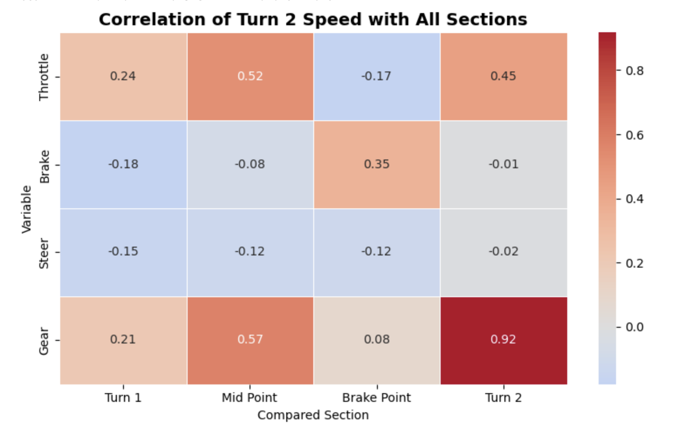

The following correlation matrix compares our intended response variable Turn 2 exit speed with key driver control variables (Throttle, Brake, Steer, Gear) at different measured at three different track sections: Turn 1 and 2, Mid Point, and Brake Point.

- **Throttle at Mid Point (r = 0.52)** shows the **strongest positive correlation** with Turn 2 exit speed.  
  Drivers who apply throttle earlier through the midpoint tend to carry higher speed when exiting Turn 2, indicating that efficient exit speed begins with **early throttle modulation** rather than late acceleration alone.

- **Brake at Brake Point (r = 0.35)** exhibits a **moderate positive correlation**.  
  Drivers who brake effectively — slowing just enough without excessive deceleration — maintain higher power through the turn, leading to stronger exit speeds.

- **Throttle at Turn 1 (r = 0.24)** also contributes positively but with a weaker effect.  
  Smooth and controlled throttle application through Turn 1 helps maintain rhythm and vehicle balance before Turn 2, though it is less decisive than mid-point throttle control.

- **Negative correlations** were observed for **Brake at Turn 1 (-0.18)** and **Throttle at Brake Point (-0.17)**.  
  Excessive braking early, or delayed throttle input after braking, tends to reduce overall exit speed — reflecting inefficiencies in the **energy transfer from entry to exit**.

- At **Turn 2 itself**, **Throttle (r = 0.45)** continues to display a strong positive relationship with exit speed, confirming that **progressive throttle re-application** during corner exit is essential for maximising acceleration.  
  **Gear (r = 0.92)** demonstrates the **strongest correlation overall**, showing that **correct gear selection and timely upshifting** are critical to achieving optimal exit velocity.
  
## Suggested Continuation

The **Literature Research** and **EDA** sections of this repository provide context and guidance for how future modelling work can be approached. Building on these foundations, we recommend several potential avenues for further research and experimentation:  

- **Optimising Turn 2 Exit Speed:**  
  Develop models that evaluate the optimal combination of **throttle, brake, and racing line** inputs to maximise exit speed from Turn 2. The engineered dataset [`data.csv`](./data.csv) is particularly useful for this task, as it provides interpolated metrics at the Turn 2 crossing line.
    - Recommended approaches include: 
      - Multiple Linear Regression to predict Turn 2 exit speed using driver control inputs and positional data to determine which factors (e.g., throttle, brake, gear timing) most influence exit velocity.
      - Non-linear models, such as Polynomial Regression or Decision Trees, to capture more complex patterns between telemetry features to identify which combinations of braking and throttle yield the highest exit speed.
      - Ensemble models (Random Forest or XGBoost) to assess feature importance and identify which control inputs most strongly determine exit performance.

 - **Model validation and interpretation:**  
  Cross-validation techniques (such as k-fold validation) can be used to test generalisability across different driver sessions and laps, preventing overfitting to a single driving style or session. In addition, the performance of the predictive models can be assessed using metrics, such as R-squared or RMSE for regression models and a confusion matrix for classification models.
  Moreover, visualizations can provide insightful driving strategies through Turns 1 and 2, such as control input heatmaps, that show how throttle and brake application evolve along the track, highlighting regions of smooth driving or excessive braking, and trajectory overlays, that compare predicted optimal racing lines with actual paths taken by different drivers.
  
## Usage
1. **Clone the repository**  
   ```bash
   git clone https://github.com/jamesphandatascience/DATA3001-data-f1-4.git
   ```
2. **Access the Final Data Product**
  The final cleaned and processed dataset, data.csv, is available on the home page of the repository.
  This file contains the complete, analysis-ready data product — suitable for direct use in modelling or further data analysis.

3. **Explore Engineered Data**
  Detailed statistics for each critical turn (e.g., Turn 1, Midpoint, Turn 2) are located in the Engineered_Data/ folder.
  Each file provides per-lap metrics such as speed, throttle, brake, steer, and positional data, captured at the respective critical lines.

## Project Status
As our current repository, all major data preprocessing and data engineering have been completed. This data has been cleaned and frames flagged with non-racing behaviors, faulty trajectories, and incomplete laps are filtered out, ensuring only valid racing data from Albert circuit park (track 0) remains. The final dataset, turn_2_exit_line_stats.csv, contains interpolated telemetry data, such as speed, throttle, brake, and positional metrics captured at the Turn 2 exit line for every valid lap.

Our preliminary EDA has revealed the strong correlation between driver control inputs and the exit speed. Thus, this validates that turn 2 exit speed is a suitable response measure for performance optimisation. With the cleaned and reproducible data product complete, the project is now ready to progress into the predictive modelling phase. 
   
## Support Information
- James Phan: z5360539@ad.unsw.edu.au
- Reina Liu: z5612157@ad.unsw.edu.au
- Saly Xiaoyi Mo: z5519847@ad.unsw.edu.au
- Belinda Wang: z5445872@ad.unsw.edu.au
- Courtney Luo: z5396904@ad.unsw.edu.au


## Contributors
Data Filtering and Engineering 
- James Phan

Exploratory Data Analysis
- Reina Liu
- Courtney Luo

Literature Research
- Saly Xiaoyi Mo
- Belinda Wang

## References
F1 Experiences. (n.d.). F1 questions you’ve always had but were afraid to ask. [online] Available at: https://f1experiences.com/blog/f1-questions-you-always-had-but-were-afraid-to-ask.

Huang, S. and Ren, W. (1999). Vehicle longitudinal control using throttles and brakes. Robotics and Autonomous Systems, [online] 26(4), pp.241–253. doi:https://doi.org/10.1016/S0921-8890(98)00056-6.

Michał Maniowski (2015). Optimization of driver actions and motion trajectory of FWD racing car. Mechatronics. [online] Available at: https://www.researchgate.net/publication/325923746_Optimization_of_driver_actions_and_motion_trajectory_of_FWD_racing_car.

Xiong, Y. (2010). Racing line optimization. [online] doi:http://hdl.handle.net/1721.1/64669.
